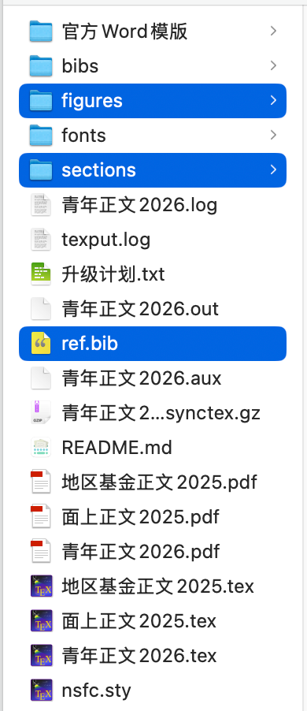

# nsfc- 国家自然基金项目 非官方LaTeX 模板

## 历史信息

NSFC 官方只有 Word 模版。2019年时，民间有南开大学程明明教授的 LaTeX [模版](http://www.latexstudio.net/archives/9308)和南京航空航天大学戴一冕博士的 [iNSFC](https://github.com/YimianDai/iNSFC)模版。本模版的制作，便始于 2019 年的 iNSFC 模版，原来 iNSFC 许久不更新，后于2024年重启更新。这期间，热心老师也制作了不少其他模版，包括：[Ruzim](https://github.com/Ruzim/NSFC-application-template-latex)、[Readon](https://github.com/Readon/NSFC-application-template-latex)、[huangwb8](https://github.com/huangwb8/ChineseResearchLaTeX)等。

本模版从 2020～2025 共 6 年一直在使用，未出现形式审查问题，这里公布出来给潜在用户做参考。

- 根据20260104基金委公布的青年基金2026版新模版进行更新。
- 根据20260105最新版青年基金2026版、面上基金2026版进行更新。
- 20260118官方模版再次更新，目前正在修改中；
- 地区官方Word模版继续等待中。。。

官方模版会根据反馈持续完善，因此本项目会在官方稳定下来之后也稳定下来。
**不要过于心急，只要你只是修改了`sections`,`figuries`,`ref.bib`，那么新模版只需要拷贝这三项过去就可以无痛更新了。**

## 下载方法

- 方法1：点击页面绿色【<>Code】按钮，点击【Download ZIP】
- 方法2：点击右侧【Release】，进入下载

## 使用方法



只需要修改上图中蓝色选中区域文件即可。其他剩余文件，可以直接采用模版替换，编译就是最新版。

- windows、macOS、overleaf用户都可以在`xx正文.tex`使用以下设置设置；编译器用XeLaTeX；overleaf用户需要注意的是，字体文件夹也要上传到云端：

```latex
%windows、macOS用户都可用
\documentclass[UTF8, punct, oneside, fontset=none]{ctexbook}
\usepackage[windows]{nsfc}
```

- macOS用户还可以使用本机自带的字体，在`xx正文.tex`使用以下设置即可：

```latex
%macOS用户独享
\documentclass[UTF8, punct, oneside, fontset=none]{ctexbook}
\usepackage[macos]{nsfc}
```

## 核对与官方word区别

为了方便大家对比本模版编译后效果和官方word模版的区别，可以使用下述设置：

```latex
%用来对比模版有无变化。对比时，请注释掉以下语句：
%\renewcommand{\input}[1]{\vspace{\baselineskip}}
```

每年模版的文字虽然大差不差，保不齐会有略微改动，请仔细对照文字是否有改动；遇到问题可以进群交流，由于无法扫码进群，请加fylimas微信进群。

